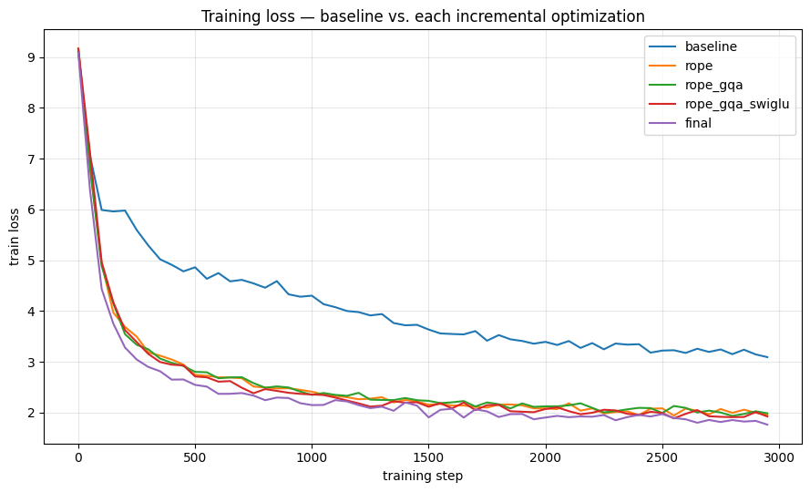

# Building a Modern Decoder-Only LLM

**RoPE, Grouped-Query Attention, SwiGLU, and Pre-RMSNorm, implemented, trained, and benchmarked from scratch**

This notebook builds a GPT-style decoder-only transformer from the ground up, then runs a controlled **ablation ladder** that starts from a faithful reproduction of the original 2017 Transformer components and swaps in one modern architectural change at a time, measuring the effect of each on validation loss, length extrapolation, and inference efficiency.

Everything (model, tokenizer, training loop, and evaluation suite) is implemented in plain PyTorch with no external modeling libraries, and trained end-to-end on the [TinyStories](https://huggingface.co/datasets/roneneldan/TinyStories) dataset.

## What's inside

- A from-scratch **BPE tokenizer**, trained on TinyStories
- A configurable **decoder-only transformer** (`GPT` / `GPTConfig`) supporting:
  - Sinusoidal positional encoding **or** Rotary Position Embeddings (RoPE)
  - Standard Multi-Head Attention **or** Grouped-Query Attention (GQA)
  - Post-LayerNorm **or** Pre-RMSNorm
  - ReLU feed-forward **or** gated SwiGLU feed-forward
  - KV-caching for efficient autoregressive generation
- A training loop with AdamW, cosine LR schedule with warmup, gradient accumulation, gradient clipping, and mixed precision
- An **evaluation suite** comparing all variants on perplexity, training curves, context-length extrapolation, KV-cache memory/throughput, and qualitative generations

## The ablation ladder

Each variant adds exactly one modernization on top of the last, so its individual effect can be isolated:

| Variant | Position enc. | Attention | Norm | FFN | Isolates |
|---|---|---|---|---|---|
| `baseline` | Sinusoidal | MHA | Post-LN | ReLU | Faithful 2017 reproduction, control group |
| `rope` | RoPE | MHA | Post-LN | ReLU | Effect of relative positional encoding alone |
| `rope_gqa` | RoPE | GQA | Post-LN | ReLU | Adds inference memory/throughput efficiency |
| `rope_gqa_swiglu` | RoPE | GQA | Post-LN | SwiGLU | Adds gated FFN sample efficiency |
| `final` | RoPE | GQA | Pre-RMSNorm | SwiGLU | Fully modernized architecture |

All five variants share the same parameter-matched backbone (`d_model=384`, 6 layers, 8 query heads) so differences in the results come from architecture, not model size.

## Loss curves for all five ablation variants


## Pipeline overview

```
text  --tokenize-->  integers  --embed-->  vectors (seq_len, d_model)
      --[N decoder blocks, same shape in and out]-->  vectors (seq_len, d_model)
      --output head-->  scores over every vocabulary word (seq_len, vocab_size)
```

## Architecture & training config

```
d_model            = 384
n_layers           = 6
n_heads (query)    = 8
n_kv_heads (GQA)   = 2   (group size = 4)
d_ff (SwiGLU)      = 1024   (~8/3 * d_model, parameter-matched to 4x ReLU FFN)
d_ff (ReLU)        = 1536   (4 * d_model)
max_seq_len        = 512
vocab_size         = 8192

block_size (train) = 256   (extrapolation tested at 384 / 512)
batch_size         = 32
grad_accum_steps   = 2      (effective batch size = 64)
max_lr             = 5e-4
weight_decay       = 0.1
warmup_steps       = 200
total_steps        = 3000   (~15-25 min per variant on a T4 GPU)
grad_clip          = 1.0
```

## Evaluation suite

The notebook produces:

1. **Final perplexity comparison** across all five variants
2. **Overlaid training loss curves** to visualize convergence speed
3. **Length-extrapolation test**: comparing RoPE vs. sinusoidal encoding when generating at sequence lengths beyond the training context
4. **KV-cache memory and decode throughput**: quantifying the inference savings from GQA vs. full MHA
5. **Side-by-side generation samples** from fixed prompts across all variants
6. **Checkpoint reload** demonstrating a saved model can be restored and used for generation

## Requirements

```
torch
datasets
tokenizers
matplotlib
```

A CUDA GPU is recommended (the notebook was built for a Colab T4); it will also run on CPU, just considerably slower.

## Usage

1. Open the notebook in Jupyter or Google Colab.
2. Run cells top to bottom:
   - **Section 1** installs dependencies and detects the device.
   - **Section 6** downloads TinyStories and trains the BPE tokenizer (cached after first run).
   - **Section 9** trains all five ablation variants sequentially, checkpointing to `CKPT_ROOT` (`/content/checkpoints` by default, or a mounted Google Drive path for persistence across Colab sessions).
   - **Section 10** runs the full evaluation suite over the trained checkpoints.
3. To do a quick smoke test before a full run, lower `TOTAL_STEPS` in Section 3.

## Checkpoints

Each variant is saved as `{variant_name}.pt` under `CKPT_ROOT`, containing the model config and state dict. Reload with:

```python
ckpt = torch.load(os.path.join(CKPT_ROOT, "final.pt"), weights_only=True, map_location="cpu")
model = GPT(GPTConfig(**ckpt["config"]))
model.load_state_dict(ckpt["model"])
```
